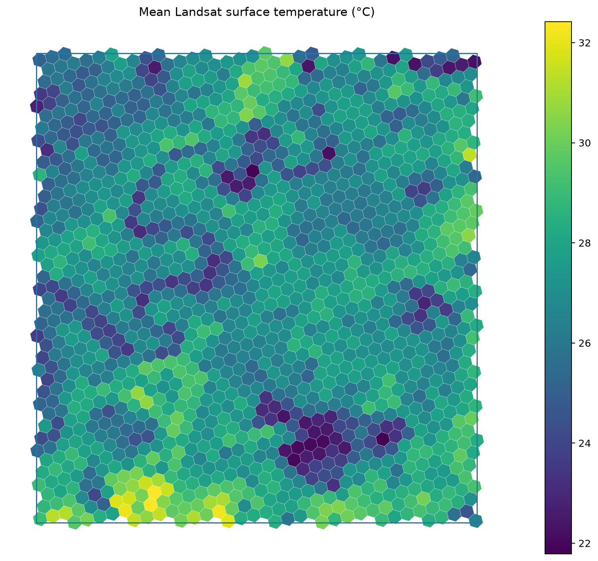
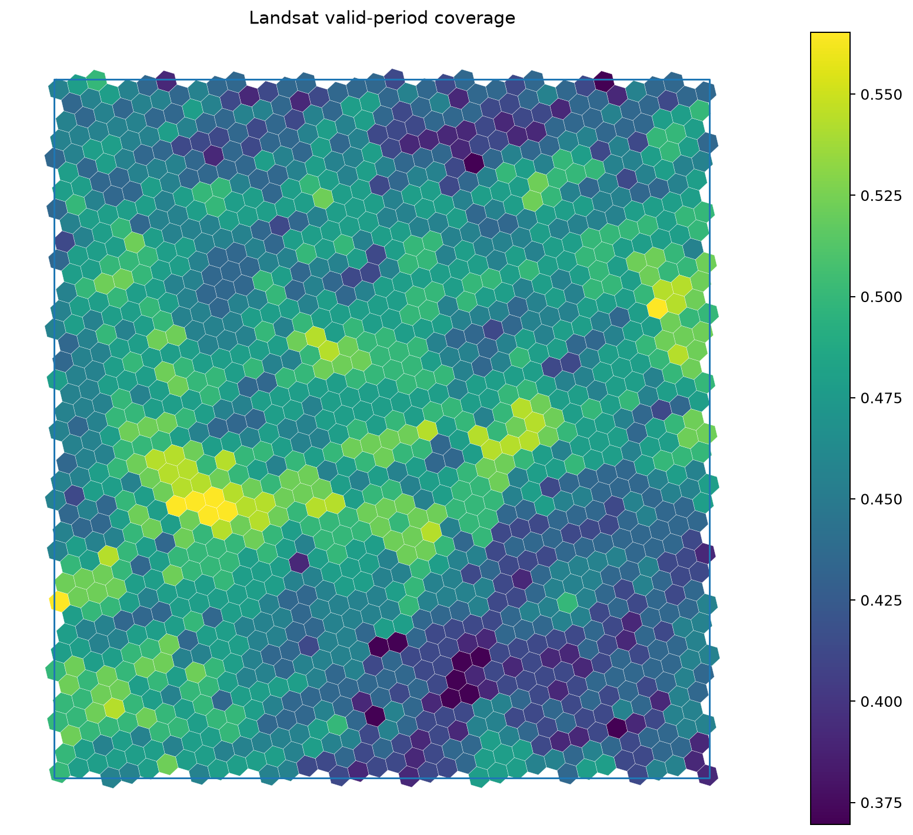

# Heat Exposure in Brisbane

This repository presents the results and visual outputs for a Brisbane heat-exposure prototype.

Here, we aim to explore how Earth observation, open geospatial data, and a hierarchical discrete global grid can be combined to identify places where high surface heat overlaps with buildings, tourism activity, and limited access to cooling or support infrastructure.

[Link](https://khizerzakir.github.io/Heat-exposure/) - to the exposure map. 

## Project objective

The core question is:

> Where do elevated surface temperatures, concentrated human activity, and limited cooling-access features overlap within Brisbane?

The prototype is designed as an exploratory decision-support workflow rather than a health-risk model. It provides a reproducible spatial framework that can be extended with additional environmental, urban, and human-exposure variables.

## Current study area

Brisbane, Queensland, Australia.

The current repository includes building-level and H3-based heat-exposure outputs for the Brisbane study area.

## Current data components

### Land surface temperature

The current prototype uses Landsat-derived land surface temperature to characterize spatial variation in surface heat.

The working implementation in the companion repository currently uses the Google Earth Engine collection:

```text
LANDSAT/COMPOSITES/C02/T1_L2_8DAY
```

The `thermal` band is converted from Kelvin to degrees Celsius:

```text
LST_C = thermal - 273.15
```

The 8-day product is useful for rapid prototyping because it provides a temporally regular Landsat composite without requiring full-scene downloads.

### Vegetation condition

NDVI is derived from the Landsat red and near-infrared bands:

```text
NDVI = (NIR - Red) / (NIR + Red)
```

Vegetation information is intended to provide context for the relationship between heat, vegetation cover, and the built environment.

### Buildings and urban features

Open building and place data are used to connect the environmental signal to urban assets and activity locations.

The repository currently includes:

```text
buildings_lst.geojson
```

which contains building geometries with associated LST information.

### H3 discrete global grid

The project uses H3 as the common analytical geography.

H3 allows climate and urban datasets with different spatial structures to be summarized within the same hierarchical grid while retaining the ability to move between local and neighbourhood scales.

The current prototype primarily uses:

```text
H3 resolution 9
```

for local analysis.

`xdggs` is used to represent the H3 grid within xarray/NetCDF workflows.

## Conceptual workflow

```text
Landsat 8-day composites
        |
        |-- Land Surface Temperature
        |-- NDVI
        |
        v
H3 / xdggs grid
        |
        +--------------------+
        |                    |
        v                    v
Building exposure       OSM / tourism activity
        |                    |
        +---------+----------+
                  |
                  v
          spatial indicators
                  |
                  v
      heat-exposure hotspot maps
```

The intention is to build toward a multi-layer exposure framework where heat conditions are interpreted together with the location and density of people-facing urban assets.

## Current outputs

### Mean H3 land surface temperature



This map shows the spatial distribution of mean Landsat surface temperature summarized to H3 cells across the Brisbane area.

### Landsat observation coverage



This map provides an important quality-control layer showing where valid Landsat information is available within the H3 grid.

Coverage should be considered alongside heat values so that low-data cells are not interpreted with the same confidence as well-observed locations.

## Building-level prototype

The repository also contains a building-level exploratory dataset:

```text
buildings_lst.geojson
```

and an interactive HTML output:

```text
index.html
```

These outputs demonstrate how H3-level environmental information can be complemented by individual building geometries where a finer asset-level view is useful.

## Planned exposure framework

The current work is moving toward a source-aware heat-exposure framework with three broad components.

### 1. Hazard

Environmental heat conditions, initially represented by:

- Landsat land surface temperature
- vegetation condition through NDVI
- temporal persistence of elevated surface temperature

Future extensions may include atmospheric heat-stress variables such as UTCI.

### 2. Exposure

Locations where people are likely to spend time, including:

- accommodation
- tourism attractions
- food and drink locations
- transport nodes
- other high-use urban places

### 3. Cooling and support access

Open urban features that may reduce exposure or support heat adaptation, including:

- drinking water
- shelters
- healthcare
- public transport access
- other cooling-related or support infrastructure where reliable open data are available

The final analysis is intended to identify cells where high heat and high activity coincide with relatively limited access to cooling or support assets.

## Why H3

A key design choice in this project is to avoid forcing every dataset onto a single raster resolution.

Instead, H3 provides a common analytical geography:

```text
fine urban data
      |
      v
    H3 9
      |
      v
    H3 8
      |
      v
    H3 7
      |
      v
regional context
```

This supports:

- multi-resolution analysis
- compact spatial indexing
- efficient joins between raster-derived and vector data
- consistent map units
- scalable aggregation
- compatibility with xarray through `xdggs`

## Interpretation

Land surface temperature is not equivalent to human thermal comfort or air temperature.

The current outputs should therefore be interpreted as **surface-heat exposure indicators**, not as direct estimates of heat-related health risk.

Similarly, missing OpenStreetMap features do not necessarily mean that a real-world service or cooling resource is absent. OSM completeness varies spatially and should be treated as an additional data-quality consideration.

## Companion implementation repository

The reproducible processing workflow is maintained in:

**OSM-Challenge**

https://github.com/khizerzakir/OSM-Challenge

The current Landsat/H3 prototype is located in:

```text
gee_landsat/
```

It contains the scripts for:

- Earth Engine Landsat access
- H3 grid generation
- `xdggs` conversion
- OSM feature retrieval
- H3 aggregation
- map generation

## Next steps

The immediate development priorities are:

1. complete the Landsat + OSM + H3 prototype for Brisbane
2. evaluate spatial patterns of heat and tourism/urban activity
3. add cooling-access indicators
4. retain source and coverage information alongside all scores
5. test alternative H3 resolutions for local and neighbourhood analysis
6. incorporate complementary thermal-stress information such as UTCI
7. develop an interpretable heat-exposure and cooling-gap index
8. create an interactive map for discussion with the Griffith team

## Repository contents

```text
.
├── Brisbane_Building Heat Stree.docx
├── buildings_lst.geojson
├── h3_landsat_coverage.png
├── h3_mean_lst.png
├── index.html
└── README.md
```

## Status

This repository contains an active research prototype. Methods, indicators, and scoring choices are still being evaluated and should not yet be interpreted as an operational heat-risk product.

## Sources


https://jstnbraaten.medium.com/ditch-the-boilerplate-use-earth-engines-on-the-fly-landsat-composites-60fb9abe707c 